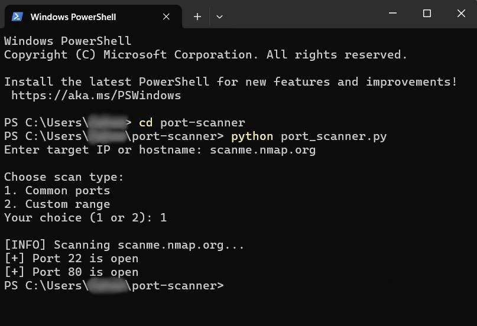
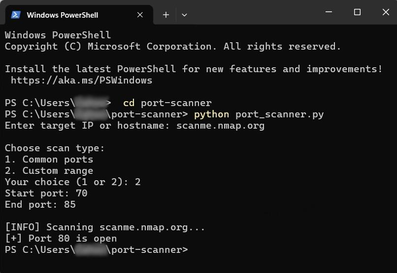

# 🔍 Python Port Scanner

A simple, command-line based TCP Port Scanner built in Python.  
This is a beginner-friendly cybersecurity tool that lets you scan a target for open ports using the built-in socket module. No external libraries or dependencies required.

---

## 🛠 Tools & Technologies

- Language: Python 3.7+
- Modules: socket, sys
- Platform: Cross-platform (Windows, Linux, macOS)
- Interface: Command-line

---

## 📸 Screenshots

### 🧑‍💻 Terminal in action (scanning common ports)



---

## 📂 Project Structure
port-scanner/

├── port_scanner.py       # Main script 

├── README.md             # Project documentation 

├── ps1.jpg               # Demo screenshot 

├── ps2.jpg               # Demo screenshot 

└── .gitignore            # Git ignore file

---

## 💻 How to Use

```bash
# Clone the repository
git clone https://github.com/Zahoooor05/port-scanner.git
cd port-scanner

# Run the script
python port_scanner.py

When you run the script, you’ll be prompted to:
	•	🖥 Enter a hostname or IP address
Example: scanme.nmap.org
	•	⚙ Choose your scan type:
	•	1 — Scan common ports (e.g., 21, 22, 80, etc.)
	•	2 — Enter a custom port range (e.g., ports 20–100)
```

---
## 🔍 How It Works

The scanner works through the following steps:

	1.	🧾 Accepts user input for a target hostname or IP address
 
	2.	🌐 Resolves the hostname using socket.gethostbyname()
 
	3.	🤔 User chooses scan type:
 
	•	Common ports: A predefined list of popular ports
 
	•	Custom range: Manually entered port range (e.g., 20–100)
 
	4.	🔌 Connects to each port using a TCP request (socket.connect_ex)
 
	5.	✅ Reports open ports where the TCP connection was successful
